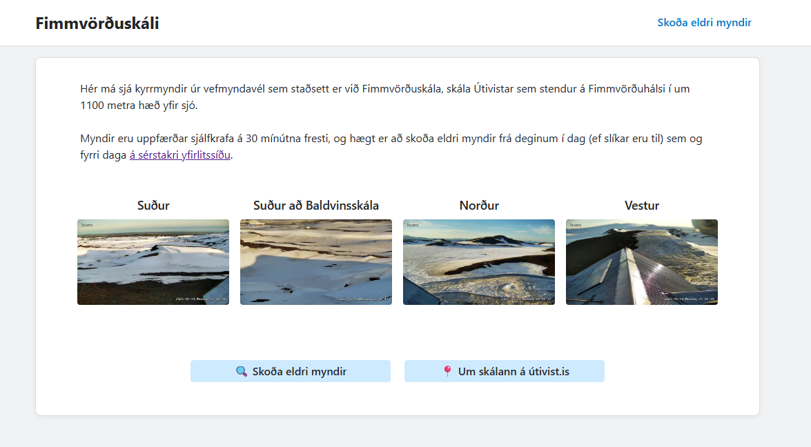

# Camera Snapshot Hosting on Azure

> Compleatly overengineered — and gloriously within hobby budget.

[](https://utivist5vhfj4cenlybqry2.z6.web.core.windows.net/index.html)

[](https://utivist5vhfj4cenlybqry2.z6.web.core.windows.net/index.html)

This project captures periodic snapshots from an **ONVIF‑compatible camera** and publishes them through an Azure‑hosted static website.  
It is optimised for **near‑zero monthly cost** using:

* **Azure Functions (Consumption)** — timer‑triggered sampler  
* **Azure Blob Storage** — stores original timeline plus a fixed **`latest/`** alias  
* **Static Website** (or public container) — exposes images via stable URLs

---

## Architecture

```
┌──────────────────────────────┐
│ Timer‑triggered Azure Function│  (every 30 min)
│  • onvif_client.snapshot_with_retry │
└──────────────┬───────────────┘
               │  .jpg files
               ▼
Snapshots ➜  snapshots/YYYY/MM/DD/snapshot_#.jpg
               │
               ├─► copy ➜ snapshots/latest/snapshot_#.jpg
               │        (stable URL per angle)
               ▼
Azure Blob Storage  (Hot→Cool→Archive lifecycle)
               │
Static Website  or   CDN
               ▼

```

---

## Infrastructure (`infra.bicep`)

| Resource | Notes |
|----------|-------|
| **Storage Account** (`staticWebsite.enabled = true`) | container `snapshots`, public read |
| **Azure Function App** (Python 3.11, Y1 plan) | timer cron `0 */30 * * * *` |
| **Application Insights** | diagnostics |

Deploy:

```bash
az deployment group create -g <ResourceGroup> -f infra.bicep -p projectPrefix=snapshot
```

Outputs include `storageUrl` for quick access.

---

## Retention & Cost Plan

This project stores **16 images per day** (4 camera angles × 4 daily time periods), each around ~0.5 MB.  
That’s roughly **8 MB/day** or **2.9 GB/year**, with automatic tiering:

- **Hot** storage (first 30 days)
- → **Cool** (next 60 days)
- → **Archive** thereafter

### Projected 5‑Year Storage Cost

| Tier    | Capacity | Price/GB | Monthly Cost |
|---------|----------|----------|---------------|
| Hot     | ~0.7 GB  | \$0.0184 | \$0.01        |
| Cool    | ~0.6 GB  | \$0.0100 | \$0.006       |
| Archive | ~12.2 GB | \$0.0010 | \$0.01        |

**Total:** ~ **\$0.03/month** by year 5  
~**\$2 total over 5 years**, assuming low traffic and standard usage.

---

⚠️ **Note on Azure Costs**

While this setup is tuned for minimal cost, be mindful of other factors:

- **Azure Functions** (Consumption Plan) is free up to generous limits  
- **Application Insights** can incur cost if logging is too verbose  
- **Blob bandwidth** is free up to 5 GB/month — traffic spikes may exceed that  
- **Storage growth** is managed via lifecycle rules — disable them and it grows forever  
- **Function timers** should stay modest (e.g. every 30 minutes, not every minute)

> This works well for low-frequency, low-traffic, public-good projects — but if you embed the images in a popular website or remove safeguards, **you could absolutely rack up costs.**

Always monitor your usage in the [Azure Portal](https://portal.azure.com), set spending alerts, and test changes on a throwaway subscription first if unsure.

This repo is offered with the **best intent** — but **you’re responsible** for your own cloud bill.

---

## License

Dual‑licensed:

- [The Unlicense](LICENSE) — public‑domain dedication  
- MIT — fallback where public domain isn’t recognised

You may use this project under **either license**, at your option.

---

## Disclaimer

THE SOFTWARE IS PROVIDED “AS IS”, WITHOUT WARRANTY OF ANY KIND, EXPRESS OR IMPLIED, INCLUDING BUT NOT LIMITED TO THE WARRANTIES OF MERCHANTABILITY, FITNESS FOR A PARTICULAR PURPOSE AND NONINFRINGEMENT. IN NO EVENT SHALL THE AUTHORS BE LIABLE FOR ANY CLAIM, DAMAGES OR OTHER LIABILITY, WHETHER IN AN ACTION OF CONTRACT, TORT OR OTHERWISE, ARISING FROM, OUT OF OR IN CONNECTION WITH THE SOFTWARE OR THE USE OR OTHER DEALINGS IN THE SOFTWARE.

---

## ONVIF Standard Notice

This project utilizes the **ONVIF** standard for camera communication.  
ONVIF® is a trademark of the ONVIF organisation.  
This project is **not affiliated with or endorsed by ONVIF**.  
For official information, visit <https://www.onvif.org/>.
